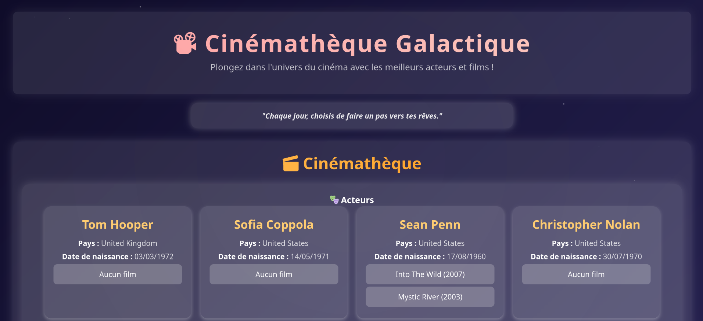

# 🎬 Cinema Management App

This project is a simple TypeScript web application for managing and displaying information about actors and films. It was built using **Vite** and demonstrates basic DOM manipulation, event handling, and TypeScript class management.

## 📸 Screenshot


## 📦 Technologies Used
- **TypeScript** for type-safe code.
- **Vite** for fast project setup and development.
- **HTML & CSS** for structuring and styling the interface.

## ⚙️ Setup Instructions

1. **Clone the repository:**
   ```bash
   git clone https://github.com/your-repo/cinema-ts-app.git
   cd cinema-ts-app
   ```

2. **Install dependencies:**
   ```bash
   npm install
   ```

3. **Run the development server:**
   ```bash
   npm run dev
   ```

4. **Run tests (optional):**
   ```bash
   npm run test
   ```

## 📝 Project Structure
```
src/
├── articles.ts       # Articles related to human rights
├── acteur.ts         # Actor class
├── film.ts           # Film class
├── cinema.ts         # Cinema management class
├── editeur.ts        # Editor for displaying and modifying articles
├── phraseDuJour.ts   # Displays a random daily quote
├── adapterCinema.ts  # Adapter pattern implementation for cinema data
└── main.ts           # Main entry point for the app
```
